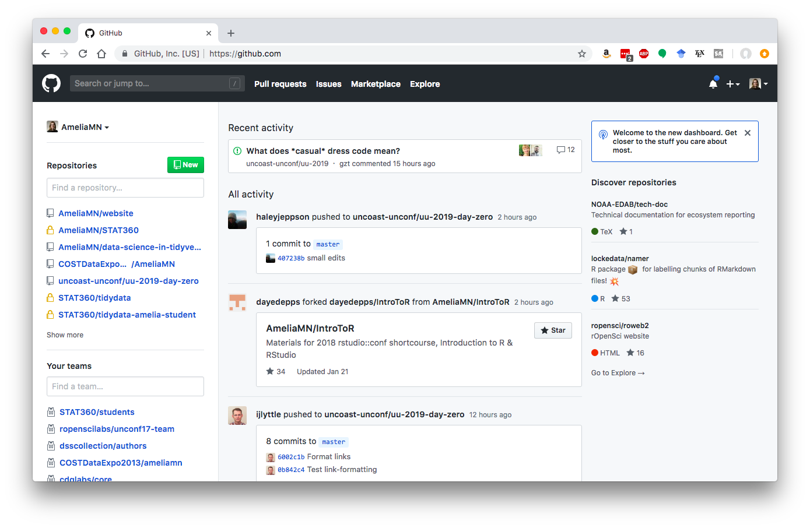
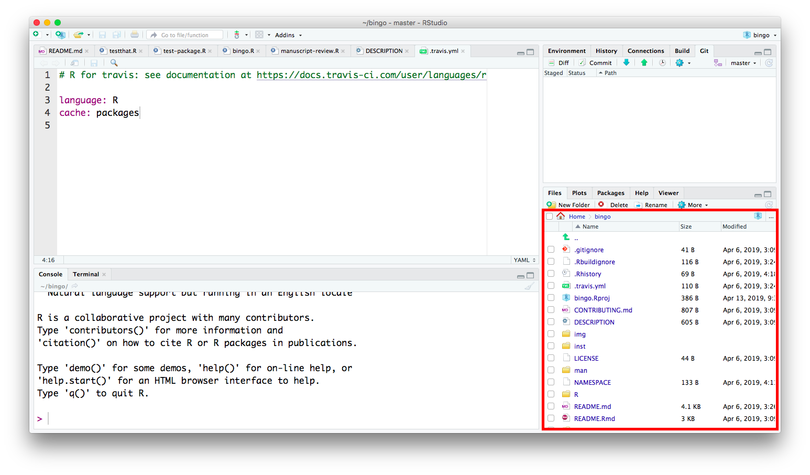
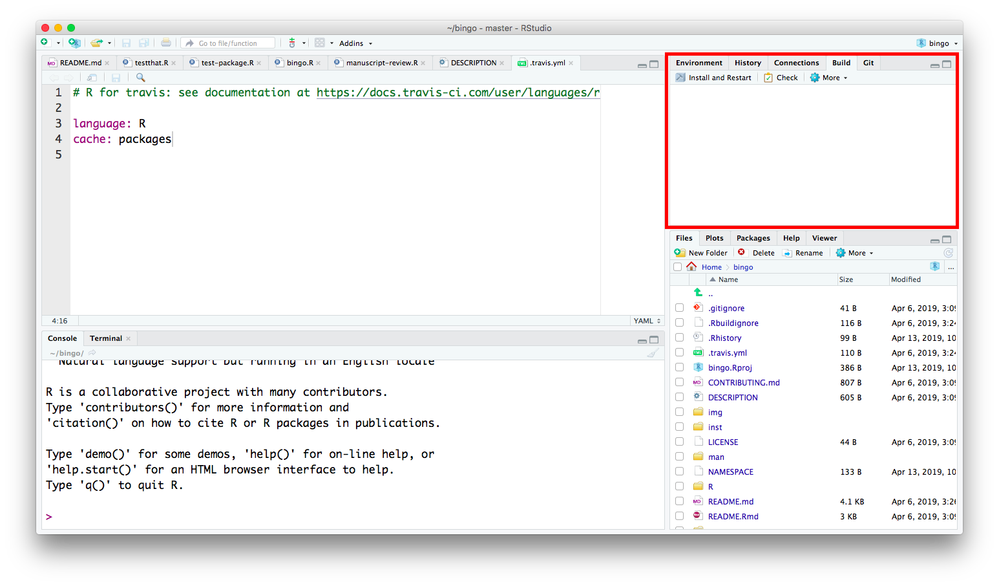
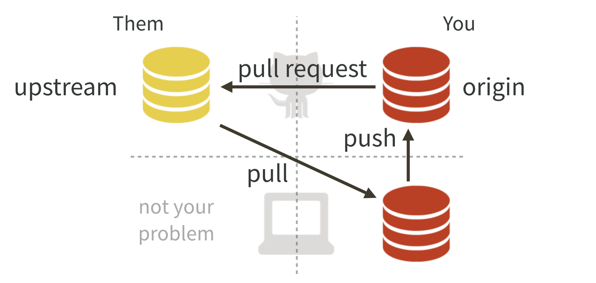
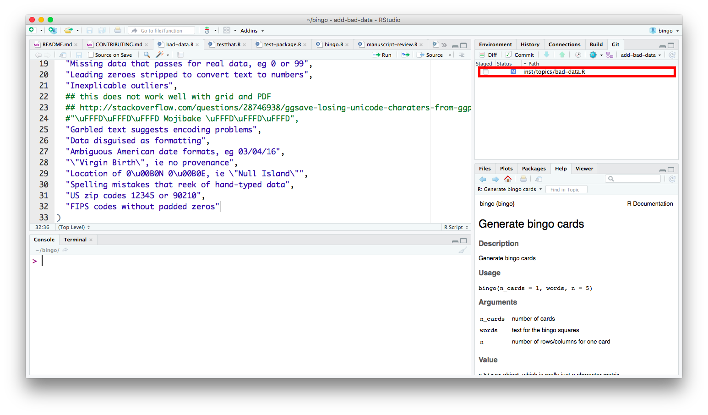
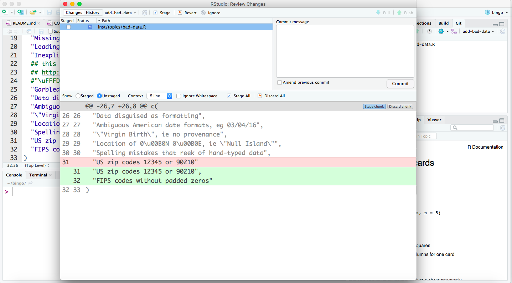
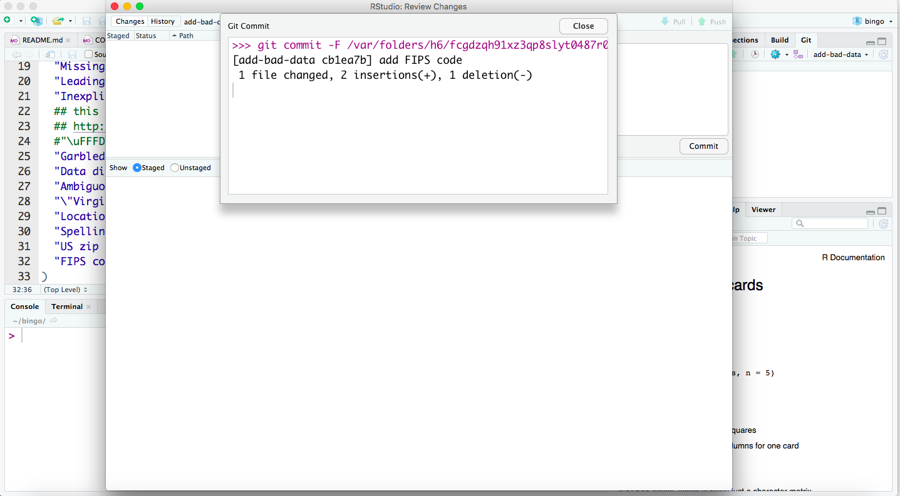
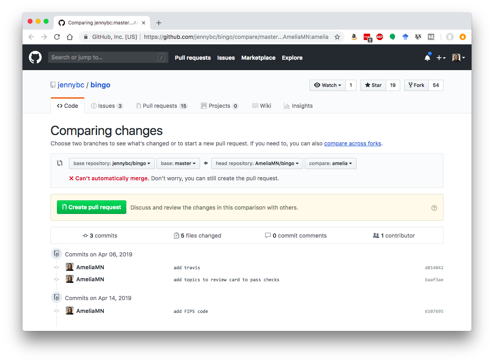
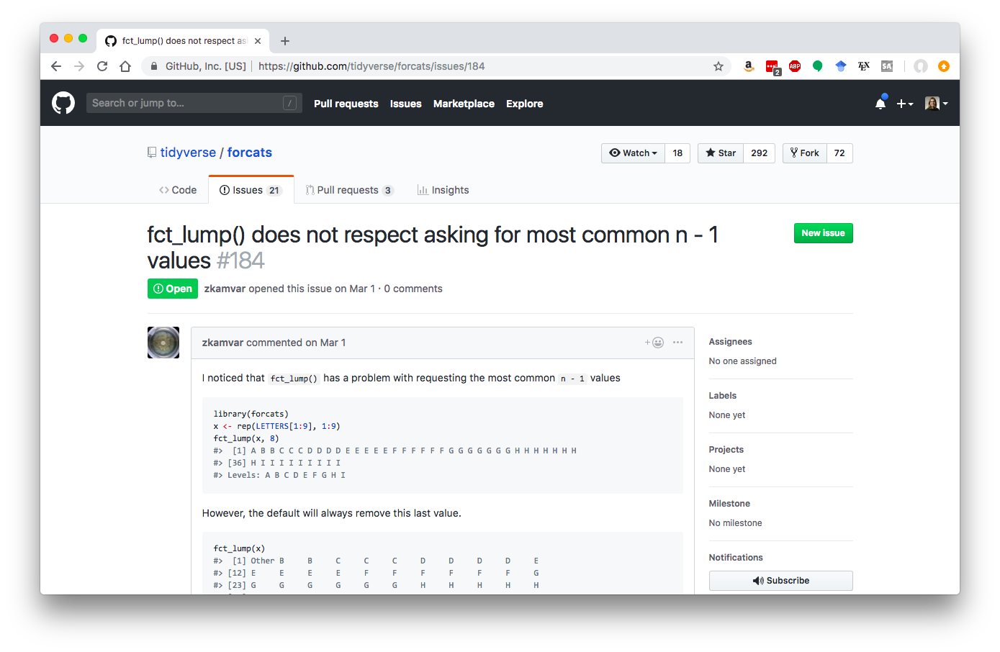

```{r setup, include=FALSE}
options(htmltools.dir.version = FALSE)
knitr::opts_chunk$set(eval=FALSE, out.height='100%')
```

## git

git is a version-control tool, typically used at the commandline. It's almost like a programming language, except it only does one thing (track changes to work). 

It allows you to "commit" changes to work, and associate descriptive messages with those stages of your work. 

There are other version control systems (most notably svn) but we're talking about git here because it works well with...

---

## GitHub

GitHub is a website where you can share code with people on the internet. It is closely coupled with git, but you can use git without GitHub, and vice versa. 



---

## Versions


via [Mine Cetinkaya-Rundel](www2.stat.duke.edu/courses/Spring18/Sta199/)

---

## Versions


via [Mine Cetinkaya-Rundel](www2.stat.duke.edu/courses/Spring18/Sta199/)

---

## What we're trying to avoid 


[PhD comics](http://phdcomics.com/comics/archive.php?comicid=1531)

---

## What we're doing this morning 

A high-level overview (I'll get more specific in a minute)

1. Make sure everything is set up on your computer
2. Fork a GitHub repository (Jenny Bryan's [bingo R package](https://github.com/jennybc/bingo))
3. Clone it to your computer
4. Build the package locally 
5. Make changes 
6. Ensure the package still builds
7. Commit changes
8. Push changes to your fork of the repo
9. Submit a pull request

If we have time...

10. Filing effective issues
11. Recovering from Git(Hub) failure
12. .gitignore

---

## Making sure everything is set up

In your RStudio, you should have a pane that has at least two tabs, one labeled Console and the other Terminal. The Console is just for `R` code, and the Terminal is more general, for commandline tools. We'll be trying to do everything in the Console, but the Terminal is our fallback for git code. 

Let's first make sure you have the `usethis` package. In your Console, type 

```{r}
library(usethis)
```

If you get an error, install the `usethis` package,

```{r}
install.packages("usethis")
```

Then, let's check the situation report on your current git/Github status. 

```{}
git_siterep()
```

Make sure that the User section at least knows your `Name` and `Email`. If one or both of those things are missing, flag one of us, and/or follow [Ian's day zero prep instructions](https://uncoast-unconf.github.io/uu-2019-day-zero/00-preparation/03-usethis/). 

---

## Fork and clone a repo

**Forking** a GitHub repository is essentially making your own copy of the code as it stands right now. 


via [Jenny Bryan and Happy git with R](https://happygitwithr.com/)

---

## Fork and clone a repo
**Cloning** is getting the files onto your own computer


via [Jenny Bryan and Happy git with R](https://happygitwithr.com/)

---
## Fork and clone a repo
Usually you do them together,


via [Jenny Bryan and Happy git with R](https://happygitwithr.com/)

---

## Fork and clone a repo

There are several different ways to fork and clone a repo. We'll be following the `usethis` way, using the `create_from_github()` function. This does all the work for us! Run this code in your Console and watch what prints. 

```{r create}
create_from_github("jennybc/bingo", protocol = "https")
```

---

## The bingo package

You should now have a new RStudio project open, containing the code from the `bingo` package. 



---

## The bingo package

You can also go on GitHub to view Jenny Bryan's version of the code, at [https://github.com/jennybc/bingo](https://github.com/jennybc/bingo) and *your* version of the code, at `https://github.com/[whatever your GitHub username is]/bingo`. For example, mine is at [https://github.com/AmeliaMN/bingo](https://github.com/AmeliaMN/bingo).

Right now, all these places look pretty much the same, but we're going to start contributing to the package. 

---

## Build tab

Notice that the RStudio project for `bingo` has a new tab, called Build. This is because our project is for a package. 



---

## Install and Restart

Let's begin by installing the package locally and restarting our R. Click the "Install and Restart" button and watch what happens in the pane and in the Console. 


```{r, echo=FALSE, eval=TRUE}
library(bingo)
```

---

## Play with the package

This package doesn't do too terribly much, but you can try out some of the functions in the package, like

```{r, eval=TRUE}
get_topics()
```

and then pick a topic to see the cards of, like

```{r, eval=TRUE}
get_topic("bad-data")
```

---

## Pull request

Our eventual goal is to create a "pull request," to request that the GitHub repo owner (Jenny Bryan) incorporates some changes we have made. 



via [Jenny Bryan and Happy git with R](https://happygitwithr.com/)

---

## Getting ready -- branch

Before we start making changes, we should prepare for eventually making a pull request (often abbreviated PR when people are writing about them). We'll use the `pr_init()` function to do this. 

It's best practice to use a separate "branch" when you make contributions. The main version of the code is hosted in the "master" branch (you can probably see that word in the top right of your git pane) and your contributions might not initially synch up with that version. 


via [tinned-software](https://blog.tinned-software.net/create-and-merge-git-branches/)

---

## Getting ready -- branch

We'll branch off from the master using `pr_init()`. You need to come up with a name for your branch, and that name can be anything you want. 

```{r}
pr_init("amelia") # this is kind of a bad branch name, you probably want to be more descriptive!
```

Run some `pr_init()` code in your Console and see what prints. What happened to the top right of your git pane?


---

## Making a change

I'm not going to talk about all the pieces of a package-- we'll get to that later today! So for now, just navigate into `bingo/inst/topics` (a folder within a folder in your Files pane) and click on one of the `.R` files there. It's filled with topics for a bingo card. There are a couple ways you could contribute to the package:

- make a whole new bingo card (at least 24 topics!)-- this one is probably best as a group
- add some topics to an existing bingo card
- ??

Let's take some time to make a change somewhere in the package. If you're making a new card, you'll need to start a new `.R` file, and if you're adding topics to an existing card, just edit that `.R` file. 

Make sure you save your changes! 

---

## Notice where changes appear

Now that you've saved a change, you should see at least one thing in your git pane. 



---

## Commit your change

Now, it's time to "commit" your change. This checks your changes into the git version control system. It's essentially telling git you have done something worth keeping track of. But, don't feel like you have to save this for a big change! In fact, it's best to commit early and often! 


via [Jenny Bryan](https://github.com/jennybc/wtf-2019-rsc) and [Martin Fowler](https://martinfowler.com/bliki/FrequencyReducesDifficulty.html)

---

## Commit your change

Click the commit button to get a pane to pop up showing the changes you can potentially commit. 



---

## Commit your change

Select whatever you are interested in committing using the checkboxes. Then, write a "commit message" (a short description of what you've done) in the box that asks for the message, and click Commit. You'll get a bit of a message that indicates you've successfully committed. You can close that message. 



---

## Push your changes

Again, there are many ways to push changes to GitHub. We're going to use the `usethis` method. 

```{r}
pr_push()
```

---

## Push your changes

Running this code will push your changes to your GitHub repository and initialize a pull request on the main repo (in this case, Jenny Bryan's repo). A browser window will pop up and show you how your pull request looks. If it's good to go, click the green button.  



---

## Not quite ready?

If your pull request isn't quite ready, it might be the case that you need to go back and make some more changes. You can go back to RStudio, make another change, save it, commit it, and `pr_push()` again. 

---

## Error?

If you get an error saying you can't push because you don't own the repo, your "remotes" are probably mis-configured. You can't push directly to Jenny Bryan's repository, you need to push to *your* GitHub repository. To fix this issue, try something along these lines:

```{r}
use_git_remote(name = "origin", url="https://github.com/AmeliaMN/bingo.git", overwrite=TRUE)

# substitute your github username for mine
use_git_remote(name = "upstream", url ="https://github.com/jennybc/bingo.git", overwrite=TRUE)
```

Now, check to make sure this looks right with 

```{r}
git_remotes()
```

Should look vaguely like this:
```
$origin
[1] "https://github.com/AmeliaMN/bingo.git"

$upstream
[1] "https://github.com/jennybc/bingo.git"

```

---

# If we have time...

---


## Filing effective issues

Usually, GitHub issues are used to track, well... issues. 
For example, [fct_lump() does not respect asking for most common n - 1 values #184](https://github.com/tidyverse/forcats/issues/184)



---

## Filing effective issues

To [file an issue](https://www.tidyverse.org/contribute/#issues), you usually need to start with a [reprex](https://www.tidyverse.org/help/#reprex).

---

## Using (and abusing?) issues

Because we have this handy way to have conversation online, we often use issues for use cases they were not designed for. For example, for the unconf we've been [discussing dress code](https://github.com/uncoast-unconf/uu-2019/issues/21), [introducing ourselves](https://github.com/uncoast-unconf/uu-2019-day-zero/issues/11), etc.


We've also been using issues to [discuss ideas for projects to work on](https://github.com/uncoast-unconf/uu-2019/issues) for the unconf. Let's take some time and look through those issues. Feel free to comment on issues that interest you, and/or create new issues! 

---


## Recovering from Git(Hub) failure

Scenario: You try to push and cannot

What's the problem?

There are changes on GitHub that you don't have.

Pull. If the gods smile upon you, merge works. Now push.

via [Jenny Bryan](https://github.com/jennybc/wtf-2019-rsc)

---

## Recovering from Git(Hub) failure

Let's create this situation.

Make sure local Git pane is clear.

Make sure local and remote are synced (push, pull).

Edit & commit to file *A* locally. Edit & commit to file *B* remotely.

Try to push. You will fail.

via [Jenny Bryan](https://github.com/jennybc/wtf-2019-rsc)

---

## Recovering from Git(Hub) failure

```
jenny@2015-mbp bunny-scarf $ git push & To github.com:jennybc/bunny-scarf.git
 ! [rejected]        master -> master (fetch first)
error: failed to push some refs to 'git@github.com:jennybc/bunny-scarf.git'
hint: Updates were rejected because the remote contains work that you do
hint: not have locally. This is usually caused by another repository pushing
hint: to the same ref. You may want to first integrate the remote changes
hint: (e.g., 'git pull ...') before pushing again.
hint: See the 'Note about fast-forwards' in 'git push --help' for details.
```
Remedy? Do what it says!

pull, then push ... pull, then push ... pull, then push

via [Jenny Bryan](https://github.com/jennybc/wtf-2019-rsc)

---

## Recovering from Git(Hub) failure

Look at your Git history.

You will see a merge commit, where the local and remote changes were reconciled.

This is best case scenario and is likely with good Git habits (lots of small frequent commits and merges, no binary files in repo).

via [Jenny Bryan](https://github.com/jennybc/wtf-2019-rsc)

---

## Recovering from Git(Hub) failure

Recovering from Git(Hub) failure Scenario: You pull and get a merge conflict.

What's the problem?

GitHub can't figure out how to reconcile diffs.

Resolve the conflicts.

Or abort ... and come back later.

via [Jenny Bryan](https://github.com/jennybc/wtf-2019-rsc)

---

## Recovering from Git(Hub) failure

Let's create this situation.

Make sure local Git pane is clear.

Make sure local and remote are synced (push, pull).

Edit & commit to file *A* locally.

Make conflicting edit & commit to file *A* remotely.

Try to push. You will fail. Try to pull. You will fail. All is fail.

via [Jenny Bryan](https://github.com/jennybc/wtf-2019-rsc)

---

## Recovering from Git(Hub) failure

```
From github.com:jennybc/bunny-scarf
   958548f..3357952  master     -> origin/master
Auto-merging README.md
CONFLICT (content): Merge conflict in README.md
Automatic merge failed; fix conflicts and then commit the result.
<<<<<<< HEAD
Wingardium Leviosaaaaaaaa
=======
Wing-GAR-dium Levi-O-sa
>>>>>>> 33579525d88af071268b0a0c64c54f357712589a
```
via [Jenny Bryan](https://github.com/jennybc/wtf-2019-rsc)

---

## .gitignore

If there are things you don't want to check in to git and/or send to GitHub, you can either 

- be careful not to check the boxes next to those files when you commit, 
- or (more robust) add things to your `.gitignore` file

If you've `git_vaccinate()`-ed yourself, you already have a pretty good `.gitignore` file! For example, you'll ignore the [.DS_Store crap](https://yihui.name/en/2017/09/ds-store-crap/). 

If you have other things you want to ignore in git, like sensitive data, big files, etc., you can edit your `.gitignore`. As always, there are many ways to do this, but we'll use the `usethis` way!

```{r}
edit_git_ignore(scope="user")
edit_git_ignore(scope="project")
```

---

# Thanks!

