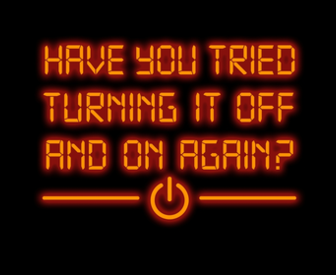
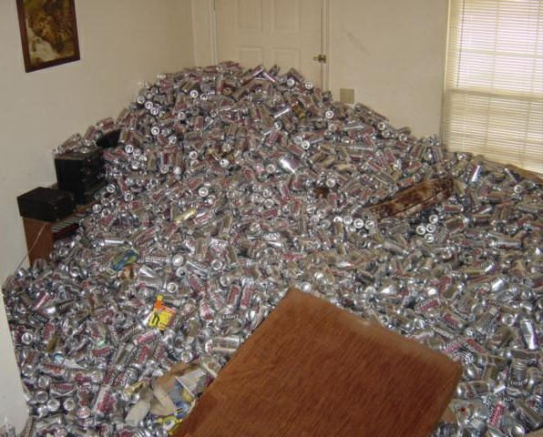
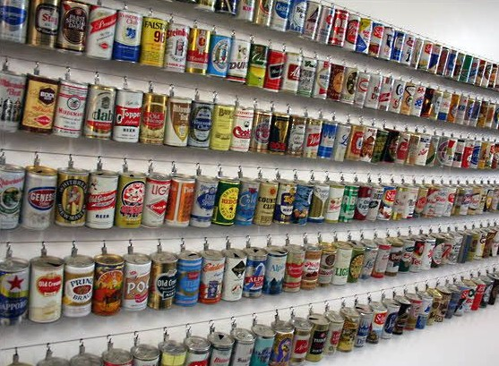

```{r setup, include=FALSE}
options(htmltools.dir.version = FALSE)
library(tidyverse)

# install_github("hadley/emo")
library(emo)
emo_pray <- emo::ji("pray")
emo_up <- emo::ji("+1")
emo_down <- emo::ji("-1")
```

# Workflow Topics

<br />

#### 1. Save the source, not the workspace  
#### 2. Project-oriented workflows
#### 3. Practice safe paths
#### 4. Naming conventions
#### 5. Debugging

---
class: inverse, middle, center
# Save the source, not <br /> the workspace

---
# Save the source, not <br /> the workspace

Attachment to your workspace indicates you have a **non-reproducible** workflow. 

<!--
This is guaranteed to lead to heartache.
-->

--

#### Suggestions on how to set up a workflow:
1. Use an IDE
2. Always start R with a blank state
3. Restart R often during development
4. Avoid `rm(list = ls())`?

???
Saving code – not workspaces – is incredibly important because it is an absolute requirement for reproducibility. 
---
## Use an IDE

An [integrated development environment](https://en.wikipedia.org/wiki/Integrated_development_environment) (IDE) makes it much easier to follow best practices.


Popular IDEs:  
- RStudio  
- Emacs + ESS  
- vim + Nvim-R  
- Visual Studio + RTVS

<br />
<br />
#### This eliminates the temptation to develop code directly in the R Console. 

???
best practices = develop reproducible code in a .R or .Rmd file

---
## Always start R with a blank slate

.pull-left[
#### The rules:
When you quit R, do not save the workspace to an `.Rdata` file.  

When you launch, do not reload the workspace from an `.Rdata` file.

#### How to enforce them:

In RStudio, set this via *Tools* > *Global Options*

`usethis::use_blank_slate()` prints a reminder about how to do this.
]
.pull-right[

]
---
## Restart R often

.pull-left[

]
.pull-right[
#### To restart:
In RStudio, menu item *Session* > *Restart R*

Keyboard shortcut: (Ctrl/Command)+Shift+F10 

#### To say "re-run all the code up to HERE":  

In an R script, use Ctrl+Alt+B (Windows and Linux) or Command+Option+B (Mac OS)  

In R markdown, use Ctrl+Alt+P (Windows and Linux) or Command+Option+P (Mac OS)  

If you run R from the shell, use Ctrl+D or q() to quit, then restart R.

]

---
## Avoid `rm(list = ls())`

This is highly *suggestive* of a non-reproducible workflow.

<br />
This line is meant to reset things, either to power-cycle the current analysis or to switch from one project to another. But there are better ways to do both:

- To power-cycle the current analysis, restart R!  

- To switch from one project to another, either restart R or, even better, use an IDE with proper support for projects, where each project gets its own R process.

<br />
#### The problem with `rm(list = ls())` is that, given the intent, it does not go far enough.

???
It’s fairly common to see data analysis scripts that begin with this object-nuking command:

This is highly suggestive of a non-reproducible workflow.


---
class: inverse, middle, center
# Project-oriented workflows




### LPT: Do this as you go, not "tomorrow" 


---
## Workflow versus Product

**Workflow** = the things you do because of personal taste and habits 

- The editor you use to write your R code.  

- The name of your home directory.  

- The R code you ran before lunch.  

**Product** = the logic and output that is the essence of your project 

- The raw data.

- The R code someone needs to run on your raw data to get your results, including the explicit `library()` calls to load necessary packages.  

<br />

#### Ideally, you don’t hardwire anything about your workflow into your product. 

???

Workflow-related operations should be executed by you interactively, using whatever means is appropriate to your setup, but not built into the scripts themselves.


---
## Staying organized

.pull-left[
`r emo_up` self-explaining  

<br />
`r emo_up`  
<br />  
`r emo_up`   

]

.pull-right[
`r emo_down` wordy, needy explainers  

<br />
`r emo_down`   

<br />
`r emo_down`   

]

<!--
<br /><br />
.center[
#### The more **deliberate** you are about where things live, <br /> the **easier** it will be for you & future you, <br /> the **easier** it will be for other people, <br /> the **easier** it will be for other computers.
]
-->

---
## `setwd("path/that/only/works/on/my/machine")`

The chance of the `setwd()` command having the desired effect – making the file paths work – for anyone besides its author is 0%. 

It’s also unlikely to work for the author one or two years or computers from now.

???
## Dilemma and solution

**The Dilemma:**

We want to work on project A with R’s working directory set to path/to/projectA and on project B with R’s working directory set to path/to/projectB.


But we also want to keep code like `setwd("path/to/projectA")` out of our .R scripts.


**Solutions:**

Set the working directory yourself, interactively, at the same time as you restart R, when you switch from project A to project B. 

Use an IDE that supports a project-based workflow. This eliminates the tension between your development convenience and the portability of the code.


---
## Adopt a project-oriented workflow

**Why?**
-  
-  
-  

**How?**
-  
-  
-  


---
## RStudio projects

---
background-image: url(https://pbs.twimg.com/media/DtlqyWZVAAIuylm.jpg:large)
background-size: 600px
background-position: 50% 80%
class: inverse, center
# Practice Safe Paths

---
## The `here` package


---
class: inverse, middle, center
# Naming Conventions

---
## 3 Principles

1. Machine readable
2. Human readable 
3. Plays well with default ordering

---
## Break logic & output into pieces

---
## Styleguide

---
class: bottom, center
background-image: url(https://pbs.twimg.com/media/D0ytsBEUYAALz7f.jpg:large)
background-size: 700px
background-position: 55% 3%

`r emo_pray` **Huge thanks** `r emo_pray` 

Most of this is built directly from the work of others

---
class: inverse
## Resources

[What They Forgot to Teach You](https://whattheyforgot.org/index.html) by Jenny Bryan & Jim Hester