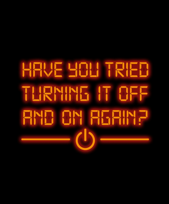
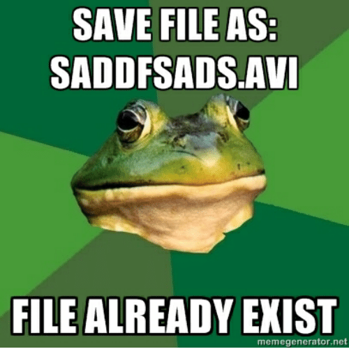
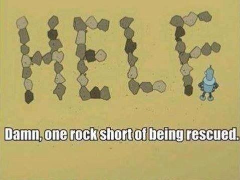

```{r setup, include=FALSE}
options(htmltools.dir.version = FALSE)
library(tidyverse)

# install_github("hadley/emo")
library(emo)
emo_pray <- emo::ji("pray")
emo_up <- emo::ji("+1")
emo_down <- emo::ji("-1")
emo_disappointed <- emo::ji("disappointed")
emo_heart_eyes <- emo::ji("smiling face with heart-eyes")
```

## Workflow topics

#### 1. Saving source & blank slates  
#### 2. Project-oriented workflow
#### 3. Practice safe paths
#### 4. Naming conventions

## Getting help

#### 5. Reprex
#### 6. Debugging

---
class: inverse, center, middle
# Saving source & blank slates 

---
## Save the source, not the workspace

Attachment to your workspace indicates that you have a **non-reproducible** workflow. 

Any individual R process and the associated workspace is disposable.

#### Everything that really matters should be achieved through code that you save. 


.small[
via Jenny Bryan's [What They Forgot](https://whattheyforgot.org/)
]
---
## Use an IDE

#### What?

An [integrated development environment](https://en.wikipedia.org/wiki/Integrated_development_environment) (IDE) makes it much easier to follow best practices.


- Popular IDEs include RStudio, Emacs + ESS, vim + Nvim-R, and Visual Studio + RTVS


<br />

#### Why?

It helps to eliminate the temptation to develop code directly in the R Console. 

#### Direction of causality:  

- Long-time coders don’t organize their work into self-contained projects and use relative paths because they use an IDE.  

- They use an IDE because it makes it easier to follow standard practices, such as these.

(More on this to come)

---
## Always start R with a blank slate

.pull-left[
#### What to do:
When you quit R, do not save the workspace to an `.Rdata` file.  

When you launch, do not reload the workspace from an `.Rdata` file.

#### How to do it:

In RStudio, set this via *Tools* > *Global Options*

`usethis::use_blank_slate()` prints a reminder about how to do this.
]
.pull-right[

.small[
via Jenny Bryan's [What They Forgot](https://whattheyforgot.org/)
]]
---


.left-minus[

] 
.right-plus[
## Restart R often

#### To restart:
In RStudio, menu item *Session* > *Restart R*

Keyboard shortcut: **[Ctrl/Command] + Shift + F10**

#### To say "re-run all the code up to HERE":  

In an R script, use <br />**[Ctrl/Command] + [Alt/Option] + B**

In R markdown, use <br />**[Ctrl/Command] + [Alt/Option] + P**

If you run R from the shell, use **Ctrl+D** or **q()** to quit, then restart R.

]

---
## Avoid `rm(list = ls())`

This is highly *suggestive* of a non-reproducible workflow.

<br />
This line is meant to reset things, either to power-cycle the current analysis or to switch from one project to another. But there are better ways to do both:

- To power-cycle the current analysis, restart R!  

- To switch from one project to another, either restart R or, even better, use an IDE with proper support for projects, where each project gets its own R process.

<br />
#### The problem with `rm(list = ls())` is that, given the intent, it does not go far enough.

---
class: inverse, middle, center
# Project-oriented workflows


.small[
via Jenny Bryan's [What They Forgot](https://whattheyforgot.org/)
]

### LPT: Do this as you go, not "tomorrow" 


---
## Workflow vs. Product

**Workflow** = the things you do because of personal taste and habits 

- The editor you use to write your R code.  

- The name of your home directory.  

- The R code you ran before lunch.  

**Product** = the logic and output that is the essence of your project 

- The raw data.

- The R code someone needs to run on your raw data to get your results, including the explicit `library()` calls to load necessary packages.  

<br />

#### Ideally, you don’t hardwire anything about your workflow into your product. 

---
background-image: url(https://pics.me.me/look-into-your-hard-drive-and-open-your-mercy-file-7551660.png)
background-size: 500px
background-position: 0% 50%

.right-plus[
### `setwd("path/that/only/works/on/my/machine")`
The chance of the `setwd()` command having the desired effect – making the file paths work – for anyone besides its author is 0%. 

It’s also unlikely to work for the author one or two years or computers from now.

]


---
background-image: url(https://pics.me.me/look-into-your-hard-drive-and-open-your-mercy-file-7551660.png)
background-size: 500px
background-position: 0% 50%

.right-plus[
### `setwd("path/that/only/works/on/my/machine")`

**Absolute path**
```
library(ggplot2)
setwd("/Users/jenny/cuddly_broccoli/verbose_funicular/foofy/data")
df <- read.delim("raw_foofy_data.csv")
p <- ggplot(df, aes(x, y)) + geom_point()
ggsave("../figs/foofy_scatterplot.png")
```

### vs.


**Relative path**

```
library(ggplot2)
library(here)

df <- read.delim(here("data", "raw_foofy_data.csv"))
p <- ggplot(df, aes(x, y)) + geom_point()
ggsave(here("figs", "foofy_scatterplot.png"))
```
]


---
## Adopt a project-oriented workflow

**Project** = a folder on your computer that holds all the files relevant to that particular piece of work

**Project-oriented workflow** = a file system discipline

- All paths are relative — relative to the project's folder  

- Eliminates the tension between your development convenience and the portability of the code.

.right-two-thirds[
```
.project_name/
|-- data
|   -- data-clean.csv
|   -- data-raw.csv
|   -- data-results.csv
|-- code
|   -- analysis.R
|   -- wrangle.R
|-- figs
|   -- barchart.png
|-- report.Rmd
```
]

---
## RStudio Projects

**The RStudio IDE (capital "P") Project:** a very effective implementation of the (small "p") projects.
.left-third[


.small[
via Jenny Bryan's [What They Forgot](https://whattheyforgot.org/)
]

]
.right-two-thirds[
#### Benefits of working in a Project:

- They are the same “unit” as a GitHub repo!

- You can designate a new or existing folder as a Project. 

  - Use `File > New Project ...` to get started.

- You can have multiple Projects going at once!
  
  - Each will have its own R process, global workspace, and working directory.

- RStudio knows about recently used Projects. 

  ]
  
---
background-image: url(https://pbs.twimg.com/media/DtlqyWZVAAIuylm.jpg:large)
background-size: 600px
background-position: 50% 80%
class: inverse, center
# Practice "safe paths"

.footnote[
.small[
via [Allison Horst](https://twitter.com/allison_horst?ref_src=twsrc%5Egoogle%7Ctwcamp%5Eserp%7Ctwgr%5Eauthor)
]]

---
## Tips to avoid `setwd()`

#### Use projects and the `here` package:

- Organize each logical project into a folder on your computer.

- Make sure the top-level folder advertises itself as such. 
  
  - This can be as simple as having an empty file named `.here`. 
  
  - If you use RStudio and/or Git, characteristic files are left behind that will get the job done.

- Use the `here::here()` function to build the path when you read or write a file.

  - Create paths relative to the top-level directory.

---
## The `here` package

#### What does here think the top-level of current project is?

`here::here()`  
`#> [1] "/home/haley/Documents/project"`


<br />
#### Bulid a path to something in a subdirectory:

`here("one", "two", "awesome.txt")`  
`#> [1] "/home/haley/Documents/project/one/two/awesome.txt"`  
<br />

#### This will run, with no edits, for anyone who follows the convention about launching R <br />in the project folder.

.footnote[
For more, read Jenny Bryan's post
[Ode to the here package
](https://github.com/jennybc/here_here).
]


If no criteria match, the current working directory will be used as fallback.
---
background-image: url(https://www.huridocs.org/wp-content/uploads/2016/07/filenaming-comic.png)
background-size: 300px
background-position: 50% 80%
class: inverse, center
# Naming Conventions

---
.left-column-small[
.right[
<br /><br /><br />

# `r emo::ji("scream_cat")`

<br /><br /><br /><br /><br /><br /><br />

#`r emo::ji("smiley_cat")`
]
]
.right-column-large[

#### myabstract.docx  

#### Joe’s Filenames Use Spaces and Punctuation.xlsx

#### figure 1.png

#### homework1.R

#### JW7d^(2sl@deletethisandyourcareerisoverWx2*.txt

<br /><br />

#### 2018-01_bryan-abstract-rstudio-conf.docx

#### joes-filenames-are-getting-better.xlsx

#### fig01_scatterplot-talk-length-vs-interest.png

#### bryan_hw01.R

#### 1986-01-28_raw-data-from-challenger-o-rings.txt
]


---
.left-minus[

]
.right-plus[
## Three principles

#### 1. Machine readable
  
#### 2. Human readable 

#### 3. Plays well with default ordering
]

---
## 1. Machine readable

**Regular expression and globbing friendly:** avoid spaces, punctuation, case sensitivity, etc.


**Easy to compute on:** deliberate use of delimiters

  - `"_"` underscore used to delimit units of meta-data I want later

  - `"-"` hyphen used to delimit words so my eyes don't bleed


---
## 1. Machine readable

.left-column-small[
.right[
# `r  emo::ji("tada")`

<br /><br /><br /><br /><br />
#`r  emo::ji("x")`
]
]
.right-column-large[
#### Easy to search for files later

#### Easy to narrow file lists based on names

#### Easy to extract info from file names, e.g. by splitting

<br /><br />

#### Spaces in file names

#### Punctuation

#### Accented characters

#### Different files named `foo` and `Foo`
]
---
background-image: url(https://raw.githubusercontent.com/Stat585-at-ISU/materials-2017/master/05_reproducibility/img/01-naming/slug.jpg)
background-size: 300px
background-position: 90% 95%
## 2. Human readable


---
## 3. Plays well with default ordering

**Put something numeric first & left pad other numbers with zeros**


**Use the ISO 8601 standard for dates**


---
## Comprehensive map of all countries that use the MM-DD-YYYY format


From https://twitter.com/donohoe/status/597876118688026624.

---
## Staying organized


.small[
via Jenny Bryan's [What They Forgot](https://whattheyforgot.org/)
]
---
## A *humane* API for your analysis

.pull-left[

]
.pull-right[
There are going to be files, LOTS of files

The files will change over time

The files will have relationships to each other

It’ll probably get complicated

]

---
## A *humane* API for your analysis

.pull-left[

]
.pull-right[
There are going to be files, LOTS of files

The files will change over time

The files will have relationships to each other

It’ll probably get complicated

<br />

**Remedies:**

Beware of monoliths

Break logic & output into pieces

The more things are self-explanatory, the better

]
???

---
## Data analysis workflow

<br />
.pull-left[
<table style="border-collapse:collapse;border-spacing:0;border-width:1px;border-style:solid;border-color:#ccc" class="tg"><tr><th style="font-family:Arial, sans-serif;font-size:14px;font-weight:bold;padding:10px 5px;border-style:solid;border-width:0px;overflow:hidden;word-break:normal;border-color:#000000;color:#333;background-color:#f0f0f0;text-align:left">Stage</th><th style="font-family:Arial, sans-serif;font-size:14px;font-weight:bold;padding:10px 5px;border-style:solid;border-width:0px;overflow:hidden;word-break:normal;border-color:#000000;color:#333;background-color:#f0f0f0;text-align:left">Input</th><th style="font-family:Arial, sans-serif;font-size:14px;font-weight:bold;padding:10px 5px;border-style:solid;border-width:0px;overflow:hidden;word-break:normal;border-color:#000000;color:#333;background-color:#f0f0f0;text-align:left">Code</th><th style="font-family:Arial, sans-serif;font-size:14px;font-weight:bold;padding:10px 5px;border-style:solid;border-width:0px;overflow:hidden;word-break:normal;border-color:#000000;color:#333;background-color:#f0f0f0;text-align:left">Output</th></tr><tr><td style="font-family:Arial, sans-serif;font-size:14px;padding:10px 5px;border-style:solid;border-width:0px;overflow:hidden;word-break:normal;border-color:#000000;color:#333;background-color:#f9f9f9;text-align:left">Import</td><td style="font-family:Arial, sans-serif;font-size:14px;padding:10px 5px;border-style:solid;border-width:0px;overflow:hidden;word-break:normal;border-color:#000000;color:#333;background-color:#f9f9f9;text-align:left"></td><td style="font-family:Arial, sans-serif;font-size:14px;padding:10px 5px;border-style:solid;border-width:0px;overflow:hidden;word-break:normal;border-color:#000000;color:#333;background-color:#f9f9f9;text-align:left"></td><td style="font-family:Arial, sans-serif;font-size:14px;padding:10px 5px;border-style:solid;border-width:0px;overflow:hidden;word-break:normal;border-color:#000000;color:#333;background-color:#f9f9f9;text-align:left"></td></tr><tr><td style="font-family:Arial, sans-serif;font-size:14px;padding:10px 5px;border-style:solid;border-width:0px;overflow:hidden;word-break:normal;border-color:#000000;color:#333;background-color:#fff;text-align:left">Tidy</td><td style="font-family:Arial, sans-serif;font-size:14px;padding:10px 5px;border-style:solid;border-width:0px;overflow:hidden;word-break:normal;border-color:#000000;color:#333;background-color:#fff;text-align:left">data/raw-data.xlsx</td><td style="font-family:Arial, sans-serif;font-size:14px;padding:10px 5px;border-style:solid;border-width:0px;overflow:hidden;word-break:normal;border-color:#000000;color:#333;background-color:#fff;text-align:left">code/wrangle.R</td><td style="font-family:Arial, sans-serif;font-size:14px;padding:10px 5px;border-style:solid;border-width:0px;overflow:hidden;word-break:normal;border-color:#000000;color:#333;background-color:#fff;text-align:left">data/cleaned-data.csv</td></tr><tr><td style="font-family:Arial, sans-serif;font-size:14px;padding:10px 5px;border-style:solid;border-width:0px;overflow:hidden;word-break:normal;border-color:#000000;color:#333;background-color:#f9f9f9;text-align:left">Transform,<br>Visualize,<br>&amp; Model</td><td style="font-family:Arial, sans-serif;font-size:14px;padding:10px 5px;border-style:solid;border-width:0px;overflow:hidden;word-break:normal;border-color:#000000;color:#333;background-color:#f9f9f9;text-align:left">data/cleaned-data.csv</td><td style="font-family:Arial, sans-serif;font-size:14px;padding:10px 5px;border-style:solid;border-width:0px;overflow:hidden;word-break:normal;border-color:#000000;color:#333;background-color:#f9f9f9;text-align:left">code/model.R</td><td style="font-family:Arial, sans-serif;font-size:14px;padding:10px 5px;border-style:solid;border-width:0px;overflow:hidden;word-break:normal;border-color:#000000;color:#333;background-color:#f9f9f9;text-align:left">figs/hist.png<br>figs/scatter.png<br>data/fits.rds<br>data/ests.csv<br></td></tr><tr><td style="font-family:Arial, sans-serif;font-size:14px;padding:10px 5px;border-style:solid;border-width:0px;overflow:hidden;word-break:normal;border-color:#000000;color:#333;background-color:#fff;text-align:left;vertical-align:top">Communicate</td><td style="font-family:Arial, sans-serif;font-size:14px;padding:10px 5px;border-style:solid;border-width:0px;overflow:hidden;word-break:normal;border-color:#000000;color:#333;background-color:#fff;text-align:left;vertical-align:top">figs/*<br>data/ests.csv</td><td style="font-family:Arial, sans-serif;font-size:14px;padding:10px 5px;border-style:solid;border-width:0px;overflow:hidden;word-break:normal;border-color:#000000;color:#333;background-color:#fff;text-align:left;vertical-align:top">report.Rmd</td><td style="font-family:Arial, sans-serif;font-size:14px;padding:10px 5px;border-style:solid;border-width:0px;overflow:hidden;word-break:normal;border-color:#000000;color:#333;background-color:#fff;text-align:left;vertical-align:top">report.html<br>report.pdf<br>report.docx<br></td></tr></table>

]
.pull-right[
<br />

]

---
class: inverse, center
# Minimal reproducible example



---
## Troubleshooting

#### Restart your R session


#### When in doubt, upgrade

- Your issue may be automatically solved by simply upgrading.

#### Look for help

- google exact error message

- Keyword search community.rstudio.com

- Stackoverflow - [r] tag

- read the source code

#### Ask for help

- Make a reprex

---
## How to achieve reprex-cellence<sup>1</sup>

#### A minimal reproducible example consists of the following items:

- a minimal dataset, necessary to reproduce the error

- the minimal runnable code necessary to reproduce the error, which can be run on the given dataset.

- the necessary information on the used packages, R version, and system it is run on.

- in the case of random processes, a seed (set by `set.seed()`) for reproducibility

.footnote[
[1] Thanks to [Mara Averick](https://maraaverick.rbind.io/2018/06/reprexcellence/#fn1) for that portmanteau
]
---
## Make a reprex in 2 steps

#### 1. Make your code reproducible

- Make sure you capture everything

  - i.e., include any `library()` calls and create all necessary objects  

- This can be done with the `reprex` package

#### 2. Make it minimal

- Strip away everything that is not directly related to your problem

  - remove as many add-on packages in the example as possible 

- Create a much smaller and simpler R object than the one you’re facing in real life and use `dput()` to generate the R code to recreate the data.

  - consider replacing real data with simpler built-in datasets and see if the problem persists

  
#### The more irrelevant content, the slower/harder it is to figure out the root issue. 

---
background-image: url(http://bryanavery.co.uk/wp-content/uploads/2018/11/hero-snapshot-debugger.png)
background-size: 900px
background-position: 50% 80%
class: inverse, center
# Debugging

---
## Debugging

.pull-left[
- `traceback()`: determine where a given error is occuring
  
- `print()`, `cat()`, `str()`: output diagnostic information

- `browser()`: open an interactive debugger before the error

- `debug()`: automatically open a debugger at the start of a function call
  
- `trace()`: start a debugger at a location inside a function

]
.pull-right[

]

---
class: bottom, center
background-image: url(https://pbs.twimg.com/media/D0ytsBEUYAALz7f.jpg:large)
background-size: 700px
background-position: 55% 3%

`r emo_pray` **Huge thanks** `r emo_pray` 

Most of this is built directly from the work of others

---
class: inverse
## Resources

[What They Forgot to Teach You](https://whattheyforgot.org/index.html) by Jenny Bryan & Jim Hester  

Heike Hofmann's [585X class](https://stat585-at-isu.github.io/schedule.html) at ISU

[Streamlined workflows in R](https://jules32.github.io/streamlined-workflows/#1) by Julie Lowndes

Illustrations by [Allison Horst](https://twitter.com/allison_horst?ref_src=twsrc%5Egoogle%7Ctwcamp%5Eserp%7Ctwgr%5Eauthor)
