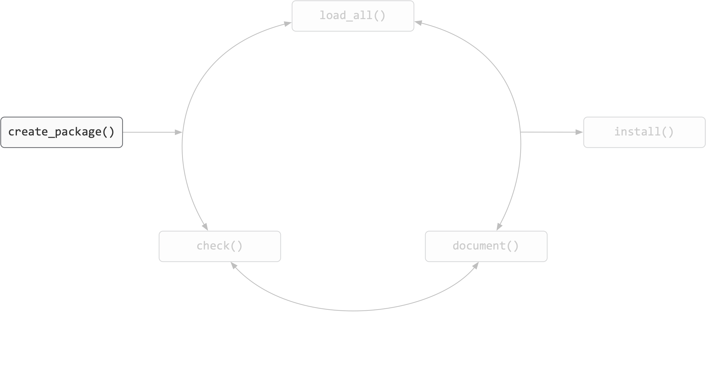
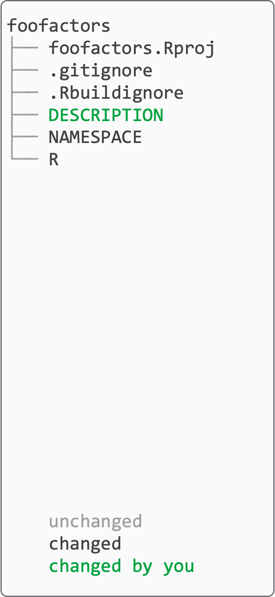
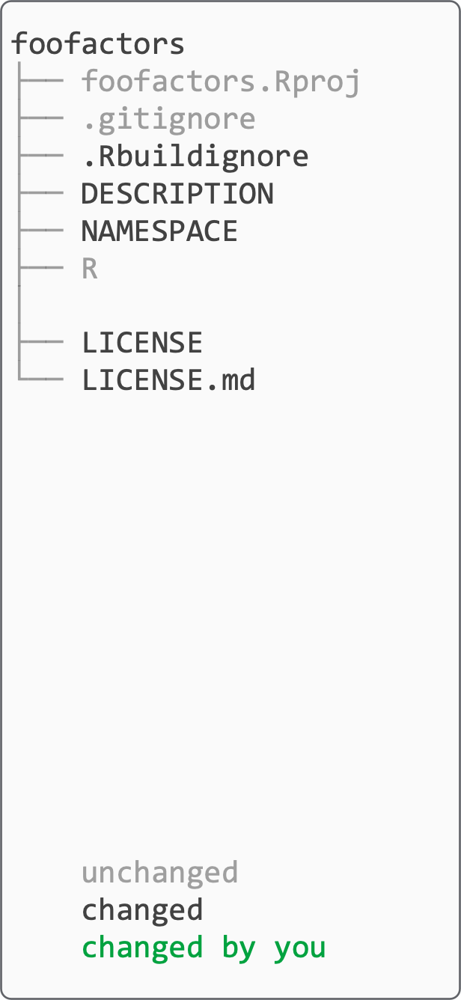
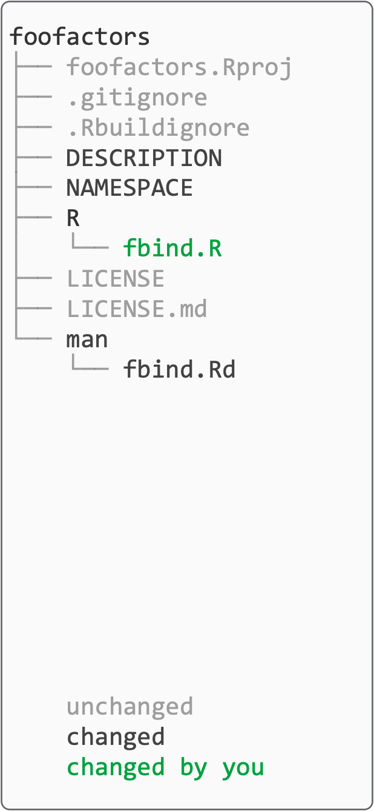
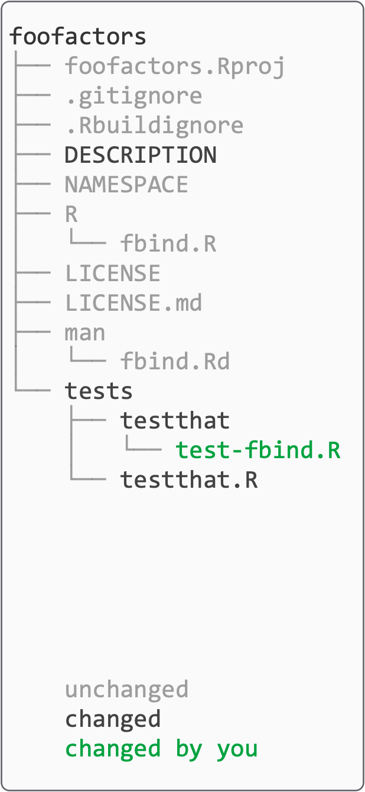
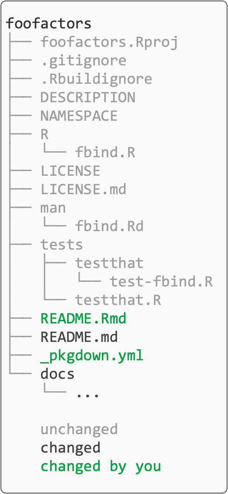

```{r setup, include=FALSE}
options(htmltools.dir.version = FALSE)
```

```{r hello, echo=FALSE, out.width='75%', fig.align='center'}

```

---

## Motivation

In the R world, versions of this are attributed to Hadley Wickham:

> Any time you copy-and-paste code three times, write a function. 
>
> Any time you copy-and-paste a function three times, write a package.

--

Also known as the [rule of three](https://en.wikipedia.org/wiki/Rule_of_three_(computer_programming): popularized by Martin Fowler (1999), attributed to Don Roberts
 
--

A way to keep stuff together:

 - documentation
 - functions
 - tests
 - data

--

Also the means for sharing stuff:

  - CRAN
  - GitHub

---

## Caveat and Assumptions


This will cover what you need to get **started** creating packages, 

--

You have gone through the day-zero prep:

- installed packages **devtools** and **usethis** (CRAN)

- git installed and configured

- GitHub account, `GITHUB_PAT` set in `.Renviron`
  
- functionality of the [starter `.Rprofile`](https://gist.github.com/ijlyttle/dee4a89c8528cd4a0a319bb7b8cdd51a)
  
--

----

`r emo::ji("scream_cat")` `install.packages(c("pkgdown", "forcats"))`

---

## References and Resources

- R Packages book, Hadley Wickham
  - [first edition](http://r-pkgs.had.co.nz/)
  - [second edition](https://r-pkgs.org/) (dev), with Jenny Bryan
  
- [usethis](https://usethis.r-lib.org/) package, Jenny Bryan and Hadley Wickham

- [Packages](https://github.com/hfrick/presentations/blob/master/2019-03-12_package_building/2019-03-12_package_building.pdf), Hannah Frick
  
- [goodPractice](https://github.com/hfrick/presentations/blob/master/2018-06-27_goodpractice/2018-06-27_goodpractice.pdf), Hannah Frick

- [You can make a package in 20 minutes](https://www.rstudio.com/resources/videos/you-can-make-a-package-in-20-minutes/), Jim Hester

----

`r emo::ji("scream_cat")` `install.packages(c("pkgdown", "forcats"))`

---

## Overview

.teach-left[
```{r verb-base, echo=FALSE, fig.align='left'}
knitr::include_graphics("workspace/img-verbs/base.png")
```

.footnote[Figure adapted from [Packages](https://github.com/hfrick/presentations/blob/master/2019-03-12_package_building/2019-03-12_package_building.pdf), by Hannah Frick]
]

--

.teach-right[ 
```{r noun-prelim, echo=FALSE, fig.align='right'}
knitr::include_graphics("workspace/img-nouns/prelim.png")
```
]

---

## Overview

.teach-left[
```{r verb-base-2, echo=FALSE, fig.align='left'}
knitr::include_graphics("workspace/img-verbs/base.png")
```

.footnote[Figure adapted from [Packages](https://github.com/hfrick/presentations/blob/master/2019-03-12_package_building/2019-03-12_package_building.pdf), by Hannah Frick]
]


.teach-right[ 
```{r noun-all, echo=FALSE, fig.align='right'}
knitr::include_graphics("workspace/img-nouns/all.png")
```
]

---

## Create package

.teach-left[
```{r verb-create-package, echo=FALSE, fig.align='left'}

```
]

.teach-right[ 
```{r noun-create-package, echo=FALSE, fig.align='right'}

```
]

---

## Create package (your turn)

.teach-left[

```r
create_package("../foofactors") # set the path to suit you
```

- creates a minimal set of files for an installable package

  - `.gitignore` helps keep you safe, `.Rbuildignore` helps keep you legal

- opens a new RStudio project

**Next**, open `DESCRIPTION` file to edit it:

- `Authors@R` field uses `options("usethis.description")` 

   - set this in `.Rprofile`

`r emo::ji("pencil2")` edit `Title` field

`r emo::ji("pencil2")` edit `Description` field

`r emo::ji("floppy_disk")` save `DESCRIPTION` file

]

.teach-right[ 
```{r noun-create-package2, echo=FALSE, fig.align='right'}

```
]

---

## Create framework

.teach-left[
```{r verb-framework, echo=FALSE, fig.align='left'}
knitr::include_graphics("workspace/img-verbs/framework.png")
```
]


.teach-right[ 
```{r noun-framework, echo=FALSE, fig.align='right'}

```
]

---

## Create framework (your turn)

.teach-left[
```r
use_git()
```

- creates a git repository in your (package) project

- makes a first commit on your behalf

- restarts RStudio

]


.teach-right[ 
```{r noun-framework-2, echo=FALSE, fig.align='right'}

```
]

---

## Create framework (your turn)

.teach-left[

```r
use_github()
```

- this is the closest you may see to **actual** magic:

  - creates GitHub repository

  - creates git remote `origin`, sets to GitHub repository

  - pushes your `master` branch to git remote

  - adds information to `DESCRIPTION` file

  - opens your repository page at GitHub

]


.teach-right[ 
```{r noun-framework-3, echo=FALSE, fig.align='right'}

```
]

---

## Create framework (your turn)

.teach-left[

```r
use_mit_license()
```

- lets the world know how it can use the stuff you create

  - CRAN requires you to specify a (valid) license

- other choices include 
 
  - `use_apl2_license()`: Apache 2.0
  
  - `use_gpl3_license()`: GPL3

- uses `option("usethis.full_name")` or `option("devtools.name")` 

  - set this in `.Rprofile`

]


.teach-right[ 
```{r noun-framework-4, echo=FALSE, fig.align='right'}

```
]

---

## Create framework (your turn)

.teach-left[

```r
use_roxygen_md()
```

- makes it **much** easier to create and maintain your function documentation

  - lets you use a markdown-like syntax

----

```r
document()
load_all()
check()
```
`r emo::ji("rocket")` commit, pull, push

]

.teach-right[ 
```{r noun-framework-5, echo=FALSE, fig.align='right'}

```
]

---

## Develop

.teach-left[
```{r verb-develop, echo=FALSE, fig.align='left'}
knitr::include_graphics("workspace/img-verbs/develop.png")
```
]


.teach-right[ 
```{r noun-develop, echo=FALSE, fig.align='right'}

```
]

---

## Develop (your turn)

.teach-left[
```r
use_r("fbind")
```

I like the idea of documenting, then writing **functions**:

- claim what the function will do, then do it

- if your explanation is getting heavy, split into more functions

Start by writing a shell for the function:

```r
fbind <- function(a, b) {
  
}
```

- place the cursor on the blank line between the `{` `r emo::ji("pencil")` `}` 

- RStudio IDE menu: **Code** > **Insert Roxygen Skeleton**

]

.teach-right[ 
```{r noun-develop-2, echo=FALSE, fig.align='right'}

```
]


---

## Develop (your turn)

.teach-left[

Complete the documentation:

```r
#' Concatenate factors, including levels
#'
#' Concatenates two factors with two differerent sets of levels, returning
#' a factor with levels that are the union of the input factors' levels.
#
#' @param a `factor`
#' @param b `factor`
#'
#' @return `factor`, concatenation of `a` and `b`
#' @export
#'
#' @examples
#' fbind(iris$Species, Puromycin$state)
#'
fbind <- function(a, b) {

}
```
]

.teach-right[ 
```{r noun-develop-3, echo=FALSE, fig.align='right'}

```
]

---

## Develop (your turn)

.teach-left[

Write the function body:

```r
#' Concatenate factors, including levels
#'
#' Concatenates two factors with two differerent sets of levels, returning
#' a factor with levels that are the union of the input factors' levels.
#
#' @param a `factor`
#' @param b `factor`
#'
#' @return `factor`, concatenation of `a` and `b`
#' @export
#'
#' @examples
#' fbind(iris$Species, Puromycin$state)
#'
fbind <- function(a, b) {
  forcats::fct_c(a, b)
}
```
]

.teach-right[ 
```{r noun-develop-4, echo=FALSE, fig.align='right'}

```
]

---

## Develop (your turn)

.teach-left[

```r
forcats::fct_c(a, b)
```

`r emo::ji("point_up")` Use this notation to be explicit about where R looks for the function `fct_c()`.

----

Making a pull-request into someone else's project, write code using their style.

- look for `CONTRIBUTING.md` 

----

`r emo::ji("floppy_disk")` Save `fbind.R`.

```r
document()
load_all()
check()
```

`r emo::ji("thinking")` What happened?

]

.teach-right[ 
```{r noun-develop-5, echo=FALSE, fig.align='right'}

```
]
---

## Develop (your turn)

.teach-left[

```r
use_package("forcats")
```

We need to specify that *our* package will use the **forcats** package:

- indicate a stronger reliance using `Imports` (default)

- indicate a weaker reliance using `Suggests` (test for package in functions)

Dependency management is a long-debated topic in the R community:

- for now, if you need to rely on a package, do it

----

```r
document()
load_all()
check()
```

`r emo::ji("rocket")` commit, pull, push

]

.teach-right[ 
```{r noun-develop-6, echo=FALSE, fig.align='right'}

```
]

---

## Test

.teach-left[
```{r verb-test, echo=FALSE, fig.align='left'}
knitr::include_graphics("workspace/img-verbs/test.png")
```
]


.teach-right[ 
```{r noun-test, echo=FALSE, fig.align='right'}

```
]

---
## Test (your turn)

.teach-left[

```r
use_testthat()
```

You need to run this only once; it sets up the testing infrastructure.

We do this to:

- make sure that our functions behave as we expect

- make sure that our functions **continue** to behave as we expect.

]


.teach-right[ 
```{r noun-test-2, echo=FALSE, fig.align='right'}

```
]

---

## Test (your turn)

.teach-left[

```r
use_test("fbind")
```

`r emo::ji("pencil2")` edit `test-fbind.R` with something like:

```r
context("Binding factors")

test_that("fbind() binds factors", {

  x <- factor(c("a", "b"))
  y <- factor(c("c", "d"))
  z <- factor(c("a", "b", "c", "d"))

  expect_identical(fbind(x, y), z)
})
```

`r emo::ji("floppy_disk")` save `test-fbind.R`

```r
test()
```

]


.teach-right[ 
```{r noun-test-3, echo=FALSE, fig.align='right'}

```
]

---

## Test (your turn)

.teach-left[

```r
document()
load_all()
check()
```

`r emo::ji("rocket")` commit, pull, push

]


.teach-right[ 
```{r noun-test-4, echo=FALSE, fig.align='right'}

```
]

---

## Document

.teach-left[
```{r verb-document, echo=FALSE, fig.align='left'}
knitr::include_graphics("workspace/img-verbs/document.png")
```
]


.teach-right[ 
```{r noun-document, echo=FALSE, fig.align='right'}

```
]

---

## Document (your turn)

.teach-left[

```r
use_readme_rmd()
```

Helps people learn why they might be interested to use *your* package.

The function produces a template: 

  `r emo::ji("pencil2")` edit to adapt to **foofactors**
  
  `r emo::ji("x")` delete CRAN-installation stuff
  
  `r emo::ji("yarn")` "Knit" to create `README.md`

---

```r
document()
load_all()
check()
```

`r emo::ji("rocket")` commit, pull, push

]


.teach-right[ 
```{r noun-document-2, echo=FALSE, fig.align='right'}

```
]

---

## Document (your turn)

.teach-left[

```r
use_pkgdown()
```

- [pkgdown]((https://pkgdown.r-lib.org/index.html) package, by Hadley Wickham and Jay Hesselberth  

  - builds a website to document your entire package
  - forces *you* to confront your documentation

`r emo::ji("pencil2")` edit `_pkgdown.yml` to [customize](https://gallery.shinyapps.io/117-shinythemes/) theme (remember newline at end):

```yaml
template:
  params:
    bootswatch: cerulean # or choose another 
```

`r emo::ji("floppy_disk")` save `_pkgdown.yml`

```r
build_site()
```

`r emo::ji("rocket")` commit, pull, push

]


.teach-right[ 
```{r noun-document-3, echo=FALSE, fig.align='right'}

```
]


---

## Document (your turn)

.teach-left[

To deploy your website using GitHub pages:

- go to the web-page for your GitHub repository

- `r emo::ji("gear")` **Settings** > **GitHub Pages** > **Source**:

- set to **master branch /docs folder** 

----

There's a lot more information at the [pkgdown web-site](https://pkgdown.r-lib.org/index.html).

]


.teach-right[ 
```{r noun-document-4, echo=FALSE, fig.align='right'}

```
]


---

## Summary

.teach-left[
```{r verb-all, echo=FALSE, fig.align='left'}
knitr::include_graphics("workspace/img-verbs/all.png")
```
]

.teach-right[ 
```{r noun-all-summary, echo=FALSE, fig.align='right'}
knitr::include_graphics("workspace/img-nouns/all.png")
```
]

---


## Random stuff (in case we have time)

`r emo::ji("thinking")` How to I do "x"?

  - What does [Tidyverse](https://github.com/tidyverse) do? 
    - Just look through the code.
  - [RStudio community](https://community.rstudio.com/) is very welcoming.

`r emo::ji("open_book")` Guides:

  - [Tidyverse style guide](https://style.tidyverse.org/)
  - [ROpenSci development guide](https://ropensci.github.io/dev_guide/)

`r emo::ji("nerd_face")` Philosophy:

 - [Tidyverse principles](https://principles.tidyverse.org)
 - Ian's [favorite issue](https://github.com/r-lib/httr2/issues/1)
 
`r emo::ji("raised_hands")` Roxygen life-savers

  - `@inheritParams my_fun`
  - `@inherit my_fun return`