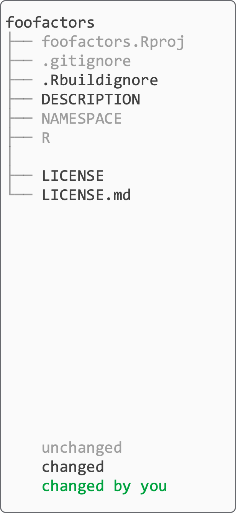

```{r setup, include=FALSE}
options(htmltools.dir.version = FALSE)
```

## Base process

.teach-left[
```{r verb-base, echo=FALSE, fig.align='left'}
knitr::include_graphics("workspace/img-verbs/base.png")
```
]

--

.teach-right[ 
```{r noun-prelim, echo=FALSE, fig.align='right'}
knitr::include_graphics("workspace/img-nouns/prelim.png")
```
]

---

## Base process

.teach-left[
```{r verb-base-2, echo=FALSE, fig.align='left'}
knitr::include_graphics("workspace/img-verbs/base.png")
```
]


.teach-right[ 
```{r noun-all, echo=FALSE, fig.align='right'}
knitr::include_graphics("workspace/img-nouns/all.png")
```
]

---

## Create package

.teach-left[
```{r verb-create-package, echo=FALSE, fig.align='left'}
knitr::include_graphics("workspace/img-verbs/create-package.png")
```
]


.teach-right[ 
```{r noun-create-package, echo=FALSE, fig.align='right'}
knitr::include_graphics("workspace/img-nouns/create-package.png")
```
]

---

## Create framework

.teach-left[
```{r verb-framework, echo=FALSE, fig.align='left'}
knitr::include_graphics("workspace/img-verbs/framework.png")
```
]


.teach-right[ 
```{r noun-framework, echo=FALSE, fig.align='right'}

```
]

---

## Develop

.teach-left[
```{r verb-develop, echo=FALSE, fig.align='left'}
knitr::include_graphics("workspace/img-verbs/develop.png")
```
]


.teach-right[ 
```{r noun-develop, echo=FALSE, fig.align='right'}
knitr::include_graphics("workspace/img-nouns/develop.png")
```
]

---

## Test

.teach-left[
```{r verb-test, echo=FALSE, fig.align='left'}
knitr::include_graphics("workspace/img-verbs/test.png")
```
]


.teach-right[ 
```{r noun-test, echo=FALSE, fig.align='right'}
knitr::include_graphics("workspace/img-nouns/test.png")
```
]

---

## Document

.teach-left[
```{r verb-document, echo=FALSE, fig.align='left'}
knitr::include_graphics("workspace/img-verbs/document.png")
```
]


.teach-right[ 
```{r noun-document, echo=FALSE, fig.align='right'}
knitr::include_graphics("workspace/img-nouns/document.png")
```
]

---

## Summary

.teach-left[
```{r verb-all, echo=FALSE, fig.align='left'}
knitr::include_graphics("workspace/img-verbs/all.png")
```
]

.teach-right[ 
```{r noun-all-summary, echo=FALSE, fig.align='right'}
knitr::include_graphics("workspace/img-nouns/all.png")
```
]
