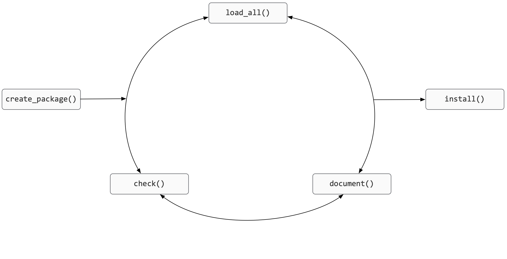
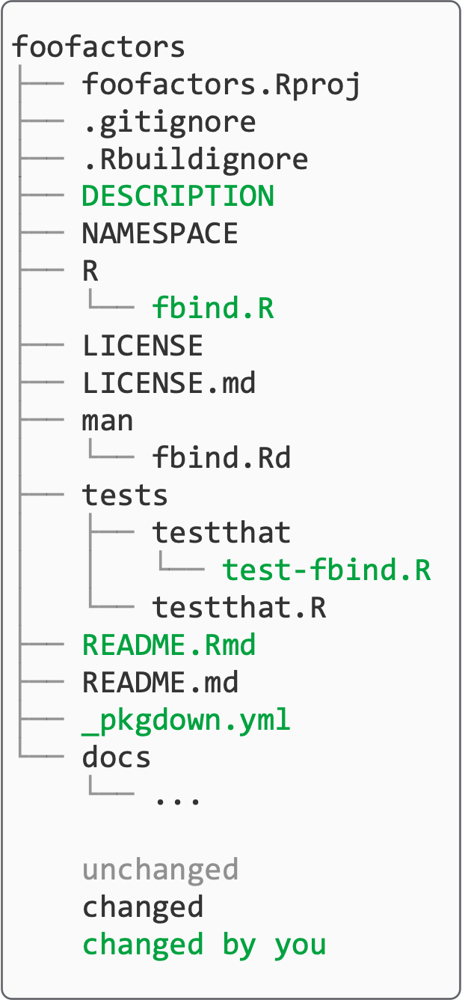
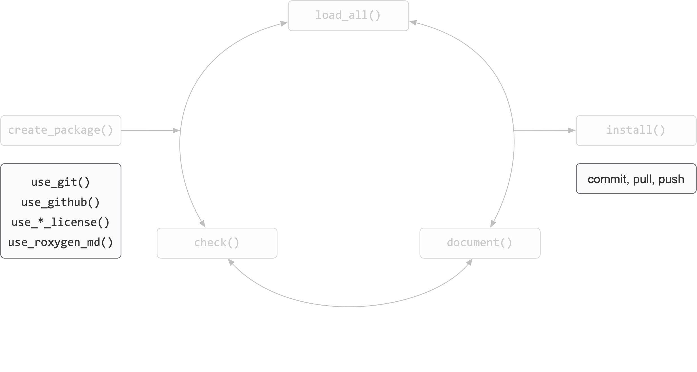
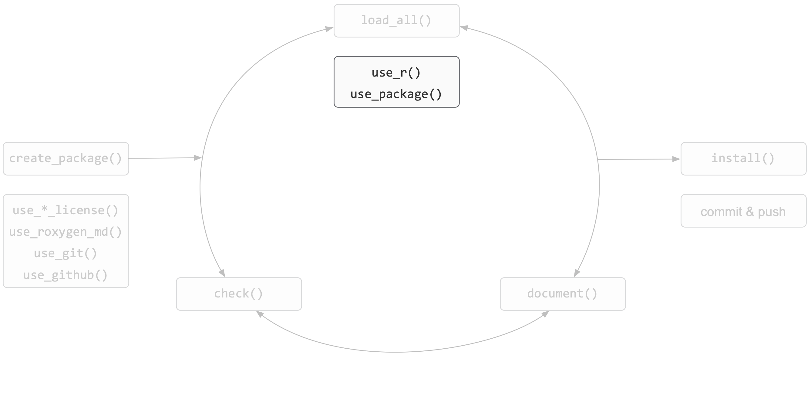
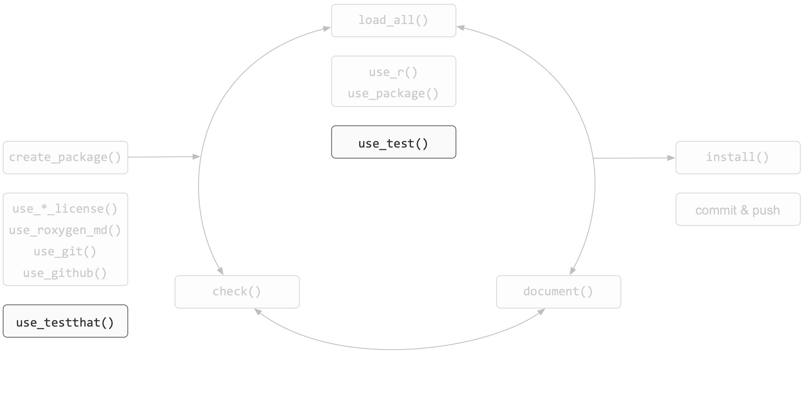
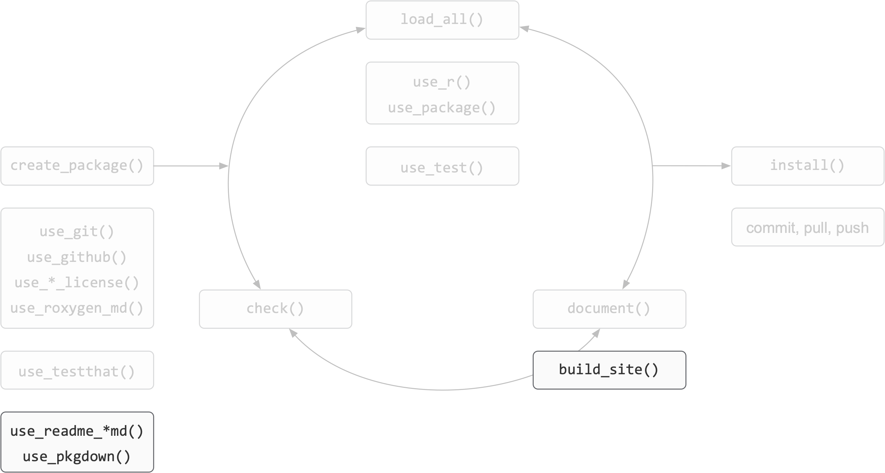
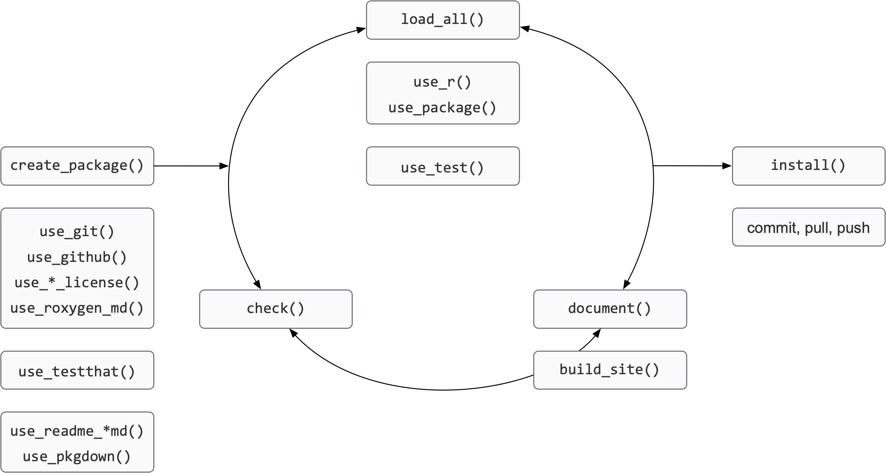

```{r setup, include=FALSE}
options(htmltools.dir.version = FALSE)
```

## Base process

```{r verb-base, echo=FALSE, out.width='75%', fig.align='center'}

```

---

## End Result

.pull-right[ 
```{r noun-all, echo=FALSE, out.width='50%', fig.align='right'}

```
]

---

## Package framework

```{r verb-framework, echo=FALSE, out.width='75%', fig.align='center'}

```


---

## Develop

```{r verb-develop, echo=FALSE, out.width='75%', fig.align='center'}

```

---

## Test

```{r verb-test, echo=FALSE, out.width='75%', fig.align='center'}

```

---

## Document

```{r verb-document, echo=FALSE, out.width='75%', fig.align='center'}

```

---

## Summary

.teach-left[
```{r verb-all, echo=FALSE, fig.align='left'}

```
]

.teach-right[ 
```{r noun-all-summary, echo=FALSE, fig.align='right'}

```
]
