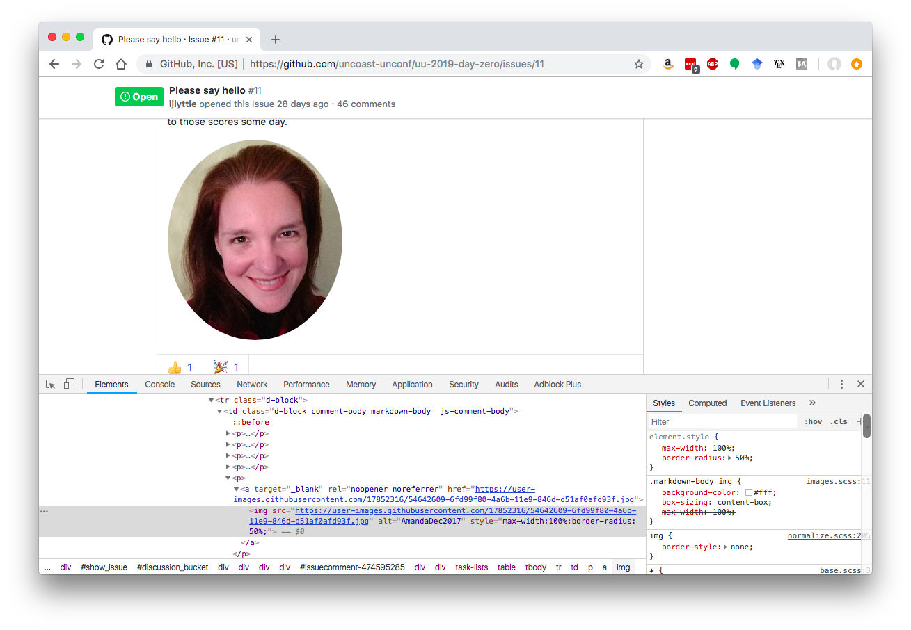
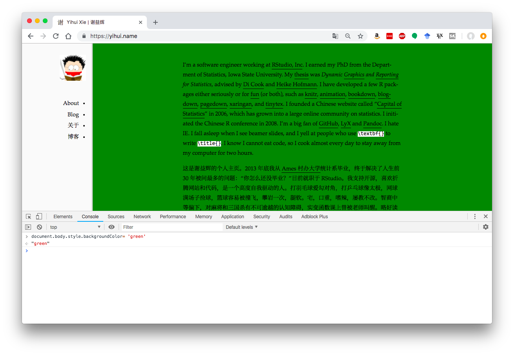
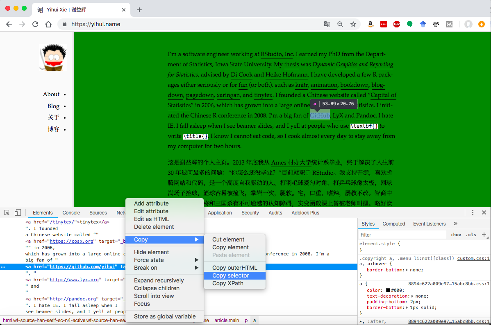

Yihui said he wasn't going to use slides, but do some live-coding. I decided to take some notes here and commit them to the day 0 repo so they would be available. 
```{r setup, include=FALSE}
knitr::opts_chunk$set(echo = TRUE)
```

Usually, I would make an html file using SublimeText2, but Yihui showed a way to use an R function to create and open a new HTML document!

```{r, eval=FALSE}
file.edit("test.html")
```

You can serve the file using the `servr` package. 

```{r, eval=FALSE}
servr::httw()
```

If you navigate to `test.html` in your Viewer, you can add code to the file, save, and see it immediately reflected in the served version. 

We started with a text file, which didn't have any tags. But now we're going to start making it more like a real HTML file. 

We're adding HTML tags into `index.html`. RStudio actually does tag matching! So cool. 

Almost every time you start a tag, like `<html>`, you need to close it with a slash version, `</html>`. This is not true for `<src>`, though.

## One magic thing

[Greg Wilson](http://third-bit.com/10rules/) has a quote, "…and that ninety percent of magic consists of knowing one extra thing."

One magic thing is to right-click on any web page and select "View Source."

## Another magic thing
You can also right-click on an element and select "Inspect" to see how any element on a page has been generated. 

## Styling

You can style globally, using css. This doesn't need to be in a separate file, it can just be between `<style>` tags in the `<head>` of your document. For example, we added the styling for `p`, which works globally. 

Another way to style things is with classes. If you have something set for a tag and something for a class, you get both. 

But, you can also override styles with other styles. For example, the id rule will override the rule on p. 
css has a heirarchical structure. You can define rules based on the order of elements on the page. `div > p` means a paragraph that is a direct child of div. With a space, it can be any descendent in the tree. `div p` could mean a paragraph that is a child, grandchild, etc. of the div


## Another piece of magic-- live-changing css on a web page

Yihui inspected an element in his browser (image of Amanda), and edited the css in the Styles panel. 



You can also filter images, invert them, blur them.... do you even need Photoshop??


## Making an external stylesheet

Again, we can make a file 
```{r, eval=FALSE}
file.edit('style.css')
```

And we can link this in our HTML `<link rel="stylesheet" href="style.css">`

## Javascript

Yihui claims he only knows two languages: R and JavaScript. JavaScript allows you to program a webpage. Again, we can edit things directly in a web browser. For example, open the browser Console and type some JavaScript code.



If you want to know exactly what element you're looking at, you can right-click an element, and select Inspect. Then, right-click the element in the HTML that shows up, select Copy and then Copy Selector.



There are many many things you can do with JavaScript, check out the [bookdown website](https://bookdown.org/yihui/blogdown/javascript.html)

## Web sockets

Q from the audience: can you talk about web sockets? 
Yihui: yes, look [here](https://yihui.name/cn/2018/09/r-web-server/) (ignore Chinese if you don't speak it, just look at the code)

Q from audience: aren't the help pages in R served by a server?
Yihui: yes, there's a server as part of R-core, but it's not exported, so we can't use it. `httpuv` is the solution. 


## Using css with xaringan

Ooh, I didn't know about the add-in of Infinite Moon Reader. It will show your slides live. This would have made my life easier...

We can make custom css for xaringan slides.

The third magic... the whole RStudio IDE is actually a web browser. So you can right-click on anything inside RStudio to inspect it. If you right-click on a slide and Inspect it, you'll see they're in class
```
class="remark-slide-content center middle inverse title-slide hljs-github"
```
So, then we could add that to our css... (I think this is right?? Not totally sure)
```
.remark-slide-content {

}
```

If you make a good css theme, you can make a PR to Yihui's package. Put the .css into this deep directory, [inst/rmarkdown/templates/xaringan/resources](https://github.com/yihui/xaringan/tree/master/inst/rmarkdown/templates/xaringan/resources)

If you want to use one, put
```
css: ["chocolate"]
``` 
into your xaringan header. 

If you dig into those files, you'll see that fonts are specified separately. For example, look at the [fonts for chocolate](https://github.com/yihui/xaringan/blob/master/inst/rmarkdown/templates/xaringan/resources/chocolate-fonts.css)